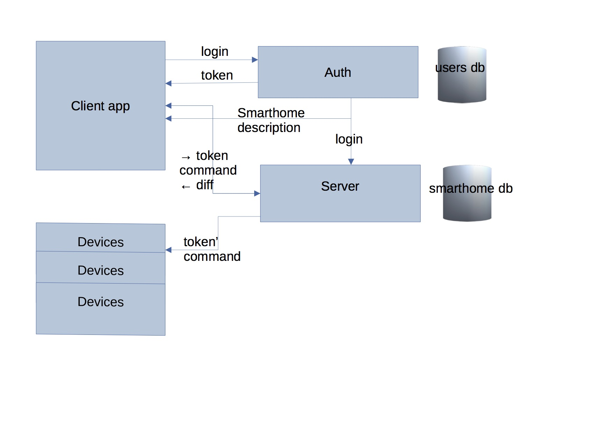

# Умный дом:

В доме устанавливаются датчики (home-devices) на различные устройства (лампочки, двери, сигнализация и т.д.). Датчиками
управляет сервер (server) по средствам rest-запросов. Используя приложение (application) можно отправить на сервер
запросы на те или иные события.

## Структура дома:

+ SmartHome - дом, содержит комнаты
+ Room - комната, содержит двери и лампочки
+ Door - дверь (межкомнатная либо входная)
+ Light - источник света (лампочки и т.д.)
+ SensorEvent - представляет события реального мира
+ SenserEventType - типы событий

## Авторизация запросов с помощью токена доступа:

1. Пользователь проходит аутентификацию
2. Сервер создает access и refresh токены, подписанные секретным ключом, а затем отправляет их клиенту
3. Токены сохраняются на клиенте и токен доступа передается на сервер с каждым последующим запросом. Для передачи токена
   используется HTTP заголовок Authorization. Токен доступа имеет ограниченное время жизни, и при истекании этого
   времени необходимо передать серверу refresh токен для получения новой пары access/refresh токенов
4. Сервер сверяет подпись токена, извлекает из него идентификатор пользователя, его роли и определяет имеет ли
   пользователь права на выполнение данного вызова
5. Для выполнения выхода из приложения достаточно просто удалить токен на клиенте без необходимости взаимодействия с
   сервером

## Взаимодействие между сервисами:

## Порты сервисов:
- authorization: http://localhost:9000
- server: http://localhost:8000

## Сборка проекта:

mvn clean install -Dactivate=qwerty -Ddeactivate=qwerty

## Rest-запросы:
1. Регистрация:
curl -i -H "Accept: application/json" -H "Content-Type:application/json" -X POST --data '{"login": "johny", "password": "123", "firstName": "John", "lastName":"Doe", "email": "john@gmail.com"}' "localhost:9000/register"
2. Логин:
curl -i -H "Accept: application/json" -H "Content-Type:application/json" -X POST --data '{"login": "John", "password": "123"}' "localhost:9000/auth"